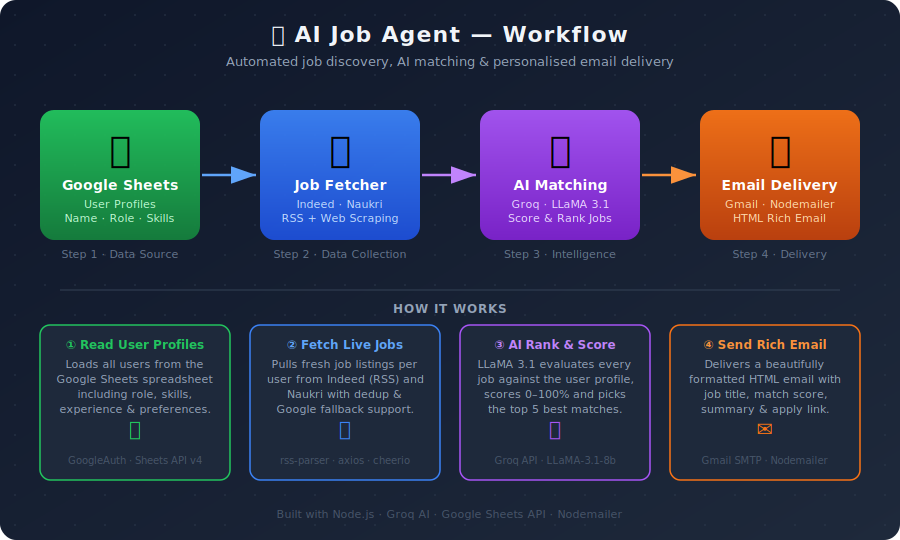

<h1 align="center">🤖 AI Job Agent</h1>

<p align="center">
  
  
  
  
  
</p>

<p align="center">
  <b>AI Job Agent</b> is a fully automated job-hunting assistant.<br/>
  It reads user profiles from a Google Sheet, fetches live job listings from <b>Indeed</b> and <b>Naukri</b>,
  uses <b>Groq AI (LLaMA 3.1)</b> to score and rank the best matches, and delivers a beautiful HTML email — all hands-free.
</p>

---

## 🗺️ Agent Workflow



---

## 📋 Try It Now — Sign Up via Google Form

<p align="center">
  <a href="https://docs.google.com/forms/d/e/1FAIpQLSdtbyXCgePuesPLpny7LHEbvIXGJKoeE1RMQs2Mqv8nmLsVmA/viewform" target="_blank">
    
  </a>
</p>

> **No setup needed.** Just fill in your profile — the agent does the rest.  
> Once you submit, your details are saved to the Google Sheet and you'll start receiving personalised AI-matched job emails automatically.

### 📝 What the form asks

| # | Field | Example |
|---|-------|---------|
| 1 | **Full Name** | Vaibhav Joshi |
| 2 | **Email Address** | you@gmail.com |
| 3 | **Professional Background** | B.Tech CSE, 3 years in web dev |
| 4 | **Primary Role** | Full Stack Developer |
| 5 | **Secondary Role** *(optional)* | Backend Developer |
| 6 | **Years of Experience** | 3 years |
| 7 | **Skills** | React, Node.js, MongoDB, AWS |
| 8 | **Key Strengths** | Problem-solving, system design |
| 9 | **Location Type** | Remote / Hybrid / On-site |
| 10 | **Preferred Location** | Pune, India |
| 11 | **Job Type** | Full-time |
| 12 | **Preferred Industry** | FinTech / SaaS |
| 13 | **Expected Salary** | ₹12 LPA |

### ✅ What happens after you submit

```
You fill the form
      ↓
Your profile is saved in Google Sheets automatically
      ↓
AI Job Agent runs → fetches jobs tailored to your role
      ↓
LLaMA 3.1 scores & ranks the best matches for you
      ↓
📧 You receive a rich HTML email with your Top 5 job matches
```

> 💡 **Tip:** The more specific your skills and role, the better the AI matching accuracy.

---

## ✨ Features

| Feature | Details |
|---|---|
| 📊 **Google Sheets Integration** | Reads multiple user profiles (name, role, skills, experience, location, etc.) from a single spreadsheet |
| 🔍 **Live Job Fetching** | Fetches jobs from **Indeed** (RSS) and **Naukri** (web scrape) with automatic deduplication |
| 🧠 **AI-Powered Matching** | Uses **Groq's LLaMA 3.1** to evaluate every job against a user profile and score 0–100% |
| 📧 **Rich HTML Emails** | Sends a responsive, card-based email per user with job title, match score, summary, and apply link |
| 🔄 **Multi-User Support** | Loops over all users in the sheet — one run handles everyone |
| 🛡️ **Graceful Fallbacks** | Falls back to Google/Indeed/Naukri search links if live scraping fails |

---

## 🏗️ Project Structure

```
Job-Agent/
├── src/
│   ├── index.js                  # 🚀 Entry point — orchestrates the full agent loop
│   ├── services/
│   │   ├── sheet.service.js      # 📊 Reads user profiles from Google Sheets
│   │   ├── jobs.service.js       # 🔍 Fetches jobs from Indeed & Naukri
│   │   ├── ai.service.js         # 🧠 AI job matching via Groq (LLaMA 3.1)
│   │   └── mail.service.js       # 📧 Sends rich HTML email via Gmail/Nodemailer
│   └── utils/
│       ├── naukri.js             # 🌐 Naukri web scraper (axios + cheerio)
│       └── logger.js             # 📝 Logging utility
├── assets/
│   └── workflow.svg              # 🖼️ Agent workflow diagram
├── credentials.json              # 🔑 Google Service Account credentials (not committed)
├── .env                          # 🔐 Environment variables (not committed)
└── package.json
```

---

## ⚙️ Prerequisites

- **Node.js** v18 or higher
- A **Google Cloud** project with the **Sheets API** enabled and a Service Account
- A **Groq API** key — get one free at [console.groq.com](https://console.groq.com)
- A **Gmail** account with an **App Password** enabled

---

## 🚀 Getting Started

### 1. Clone the repository

```bash
git clone https://github.com/Va09joshi/Job-Agent.git
cd Job-Agent
```

### 2. Install dependencies

```bash
npm install
```

### 3. Set up Google Sheets credentials

1. Go to the [Google Cloud Console](https://console.cloud.google.com/) and create a project.
2. Enable the **Google Sheets API**.
3. Create a **Service Account** and download the JSON key as `credentials.json` in the project root.
4. Share your Google Sheet with the service account email (give it **Viewer** access).

### 4. Configure the Google Sheet

Your sheet must have a tab named **`job`** with data starting at row 2.  
The columns should be arranged as follows:

| Col | Field |
|-----|-------|
| B | Name |
| C | Email |
| D | Background |
| E | Role (primary) |
| F | Secondary Role |
| G | Experience |
| H | Skills |
| I | Strengths |
| J | Score |
| L | Location Type |
| M | Location |
| N | Job Type |
| O | Industry |
| P | Salary Expectation |

### 5. Create a `.env` file

```env
# Google Sheets
SHEET_ID=your_google_sheet_id_here

# Groq AI
GROQ_API_KEY=your_groq_api_key_here

# Gmail (use an App Password, not your real password)
EMAIL=your_gmail@gmail.com
APP_PASSWORD=your_gmail_app_password
```

> **Tip:** To create a Gmail App Password, go to your Google Account → Security → 2-Step Verification → App Passwords.

### 6. Run the agent

```bash
node src/index.js
```

---

## 🔄 How It Works

```
┌─────────────────────────────────────────────────────────────────────┐
│  1. Read Users   →  Google Sheets (all rows from the "job" tab)     │
│  2. Fetch Jobs   →  Indeed RSS + Naukri scraper (per user role)     │
│  3. AI Matching  →  Groq LLaMA 3.1 scores & selects Top 5 jobs     │
│  4. Send Email   →  Nodemailer sends HTML email to each user        │
└─────────────────────────────────────────────────────────────────────┘
```

The agent processes each user sequentially with a 2-second delay between requests to avoid API rate limits. If any step fails for a user, it logs the error and continues with the next user.

---

## 📧 Sample Email Output

Each user receives an email like this:

```
Hi John,

🔥 Top Job Matches for You:

────────────────────────────
1. Senior React Developer (Indeed)
   Match Score: 92%

   🧠 Why This Matches:
   - Strong React & TypeScript skill alignment
   - Matches 4+ years experience requirement

   📄 Job Summary:
   Build scalable web apps for a FinTech startup...

   🔗 Apply Here: https://...
────────────────────────────
```

---

## 🛠️ Tech Stack

| Technology | Purpose |
|---|---|
| **Node.js** | Runtime environment |
| **Groq API + LLaMA 3.1** | AI job matching and ranking |
| **Google Sheets API v4** | User profile data source |
| **rss-parser** | Parse Indeed RSS feeds |
| **axios + cheerio** | Naukri web scraping |
| **Nodemailer** | Email delivery via Gmail SMTP |
| **dotenv** | Secure environment variable management |

---

## 🔐 Environment Variables

| Variable | Required | Description |
|---|---|---|
| `SHEET_ID` | ✅ | ID of your Google Sheet (from the URL) |
| `GROQ_API_KEY` | ✅ | Your Groq API key for LLaMA access |
| `EMAIL` | ✅ | Gmail address used to send emails |
| `APP_PASSWORD` | ✅ | Gmail App Password (not your login password) |

---

## 🤝 Contributing

Contributions, issues, and feature requests are welcome!

1. Fork the repository
2. Create your feature branch: `git checkout -b feature/my-feature`
3. Commit your changes: `git commit -m 'feat: add my feature'`
4. Push to the branch: `git push origin feature/my-feature`
5. Open a Pull Request

---

## 📄 License

This project is licensed under the **ISC License**.

---

<p align="center">Made with ❤️ by <a href="https://github.com/Va09joshi">Va09joshi</a></p>
