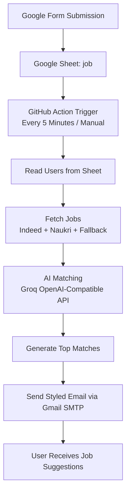

<p align="center">
  
</p>

<p align="center">
  
</p>

<p align="center">
  
  
  
  
</p>

---

## 🚀 Overview

**AI Job Agent** is a fully automated, AI-powered job matching system.  
It reads candidate preferences from Google Sheets, fetches jobs from multiple sources, ranks opportunities using AI, and sends personalized recommendations by email.

---

## ✨ Highlights

- ⚡ Automated every 5 minutes via GitHub Actions
- 🌐 Multi-source job fetching (Indeed + Naukri + fallback)
- 🧠 AI-powered relevance scoring and ranking
- 📩 Personalized HTML email delivery
- 🔄 Google Form → Google Sheet → AI → Email pipeline

---

## 🤖 AI Agent Workflow



### 🎥 Workflow Preview

<p>
  
</p>

---

## 🧩 Project Structure

```text
Job-Agent/
├── .github/workflows/agent.yml
├── src/
│   ├── index.js
│   ├── services/
│   │   ├── sheet.service.js
│   │   ├── jobs.service.js
│   │   ├── ai.service.js
│   │   └── mail.service.js
│   └── utils/
│       └── naukri.js
├── package.json
└── README.md
```

---

## ⚙️ Setup Guide

### 1) Install Dependencies

```bash
npm ci
```

### 2) Add Environment Variables

Create a `.env` file in project root:

```env
GROQ_API_KEY=your_groq_key
EMAIL=your_email
APP_PASSWORD=your_gmail_app_password
SHEET_ID=your_google_sheet_id
```

### 3) Add Google Credentials

Place your service account key file at:

```text
credentials.json
```

Make sure this service account has access to your target Google Sheet.

### 4) Run Locally

```bash
node src/index.js
```

---

## 🧪 Testing Flow

1. Submit the Google Form.
2. Verify the response appears in the `job` sheet tab.
3. Trigger GitHub Action manually (or wait for scheduler).
4. Confirm the user receives AI-generated job recommendations via email.

---

## 🔄 Automation (GitHub Actions)

- ⏱ Runs every 5 minutes
- 🖱 Manual trigger supported (`workflow_dispatch`)
- 🔐 Uses repository secrets

### Required Secrets

- `GROQ_API_KEY`
- `EMAIL`
- `APP_PASSWORD`
- `SHEET_ID`

---

## 🛠 Troubleshooting

| Issue | Solution |
|---|---|
| No users found | Check Google Sheet data and tab name (`job`) |
| No email received | Verify SMTP credentials and spam folder |
| AI errors | Validate `GROQ_API_KEY` |
| Sheet error | Check `credentials.json` and sharing permissions |

---

## 🎯 Key Benefits

- 🚀 Eliminates manual job searching
- 🎯 Delivers more relevant job matches
- 🔄 Supports real-time automated processing
- 📩 Sends clean, professional recommendation emails

---

## 👨‍💻 Author

**Vaibhav Joshi**  
🔗 https://github.com/Va09joshi

<p>
  
</p>
