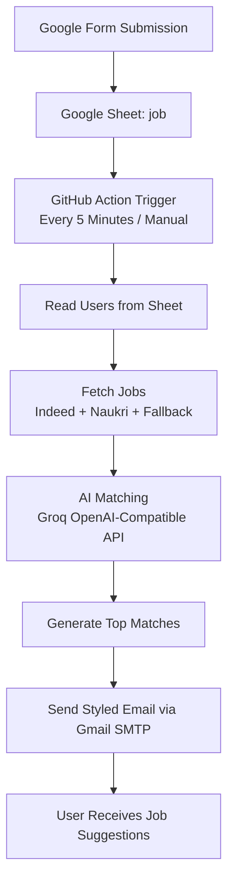

# 🚀 AI Job Agent

An automated AI-powered job matching system that:
- reads candidate preferences from Google Sheets,
- fetches jobs from Indeed + Naukri,
- ranks jobs with AI,
- emails personalized top matches.

---

## ✨ Highlights

- ✅ Automated every 5 minutes via GitHub Actions
- ✅ Multi-source job fetching (Indeed RSS + Naukri scrape + fallback)
- ✅ AI-based relevance scoring and ranking
- ✅ Personalized HTML email delivery
- ✅ Google Form → Google Sheet → Job alerts pipeline

---

## 🤖 AI-Generated Agent Workflow Image



---

## 🧩 Project Structure

```text
/home/runner/work/Job-Agent/Job-Agent
├── .github/workflows/agent.yml
├── src/index.js
├── src/services/
│   ├── sheet.service.js
│   ├── jobs.service.js
│   ├── ai.service.js
│   └── mail.service.js
└── src/utils/naukri.js
```

---

## ⚙️ Setup

### 1) Install dependencies

```bash
npm ci
```

### 2) Add environment variables

Create a `.env` file in the project root:

```env
GROQ_API_KEY=your_groq_key
EMAIL=your_gmail_address
APP_PASSWORD=your_gmail_app_password
SHEET_ID=your_google_sheet_id
```

### 3) Add Google credentials

Place your Google service account file as:

```text
credentials.json
```

It must have Sheets read access to your target spreadsheet.

### 4) Run locally

```bash
node src/index.js
```

---

## 🧪 Google Form Testing (Use This Link)

Form URL:

https://docs.google.com/forms/d/e/1FAIpQLSdtbyXCgePuesPLpny7LHEbvIXGJKoeE1RMQs2Mqv8nmLsVmA/viewform

> ⚠️ If this is a production form, enable domain restriction or share it only with intended users to avoid spam submissions.

### Test flow

1. Fill and submit the form with a valid email and role/preferences.
2. Confirm a new row appears in the Google Sheet tab named `job`.
3. Trigger the workflow manually (or wait for the 5-minute schedule).
4. Verify the submitted email receives the AI job match email.

### Expected result

- Form response is stored in Sheet (open-ended range `job!A2:Z`, i.e., all rows from row 2 onward).
- Agent fetches jobs, runs AI matching, and sends top matches by email.

---

## 🔄 GitHub Actions Automation

Workflow file:

- `.github/workflows/agent.yml`

Triggers:

- `schedule`: every 5 minutes
- `workflow_dispatch`: manual run from GitHub Actions tab

Required GitHub Secrets:

- `GROQ_API_KEY`
- `EMAIL`
- `APP_PASSWORD`
- `SHEET_ID`

---

## 🛠 Troubleshooting

- **No users found** → verify form responses are reaching the `job` sheet.
- **No job email received** → verify `EMAIL` / `APP_PASSWORD` and spam folder.
- **AI errors** → verify `GROQ_API_KEY` is valid.
- **Sheet read error** → verify `credentials.json` and sheet permissions.

---

## 📌 Notes

- Current `npm test` script is a placeholder and exits with failure by default.
- The core runtime command is `node src/index.js`.
